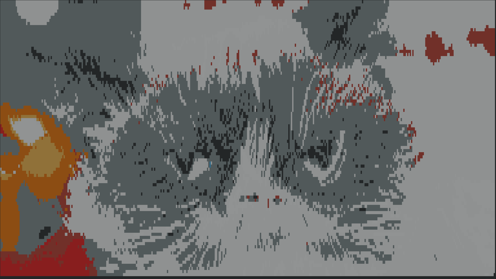

# showyourself

16 color image viewer for the terminal that uses [content aware image resizing](https://github.com/esimov/caire).

## An image

| Original image               | Context-aware resized image in a VT100 terminal emulator in 16 glorious colors   |
|------------------------------|----------------------------------------------------------------------------------|
|    |                                                 |
|  |                                               |

## Why?

I wanted to develop an image viewer that could be usable from within [`o`](https://github.com/xyproto/o), a little editor I wrote that targets VT100 compatible terminal emulators.

## General info

* Version: 1.0.0
* License: BSD-3
* Author: Alexander F. Rødseth &lt;xyproto@archlinux.org&gt;
