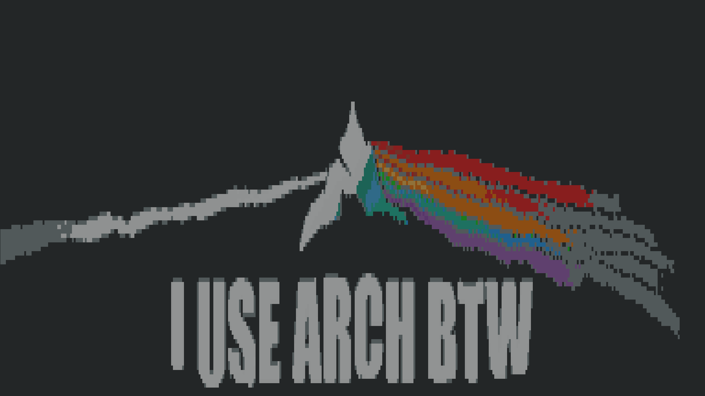
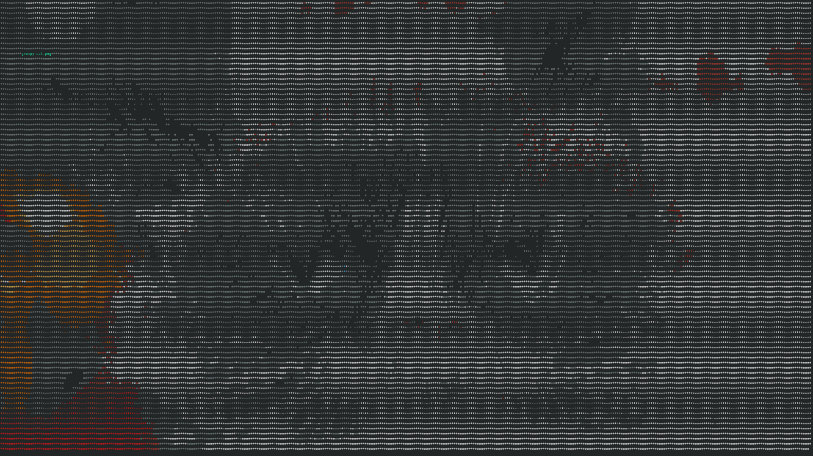
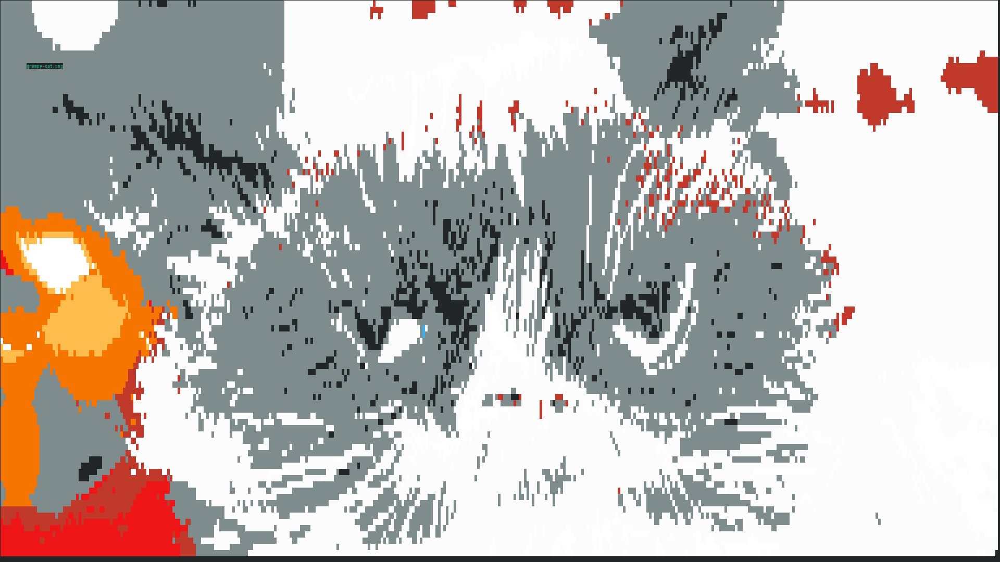

# showyourself

16 color image viewer for the terminal that uses [content aware image resizing](https://github.com/esimov/caire).

## An image

## The context-aware resized image in a VT100 terminal emulator in 16 glorious colors

## A grumpy cat

## The same image as displayed with an early version of `showyourself`

## Same as above, but drawn with `█` instead of `*`

## Why?

I wanted to develop an image viewer that could be usable from within [`o`](https://github.com/xyproto/o), a little editor I wrote that targets VT100 compatible terminal emulators.

## General info

* Version: 0.0.0
* License: BSD-3
* Author: Alexander F. Rødseth &lt;xyproto@archlinux.org&gt;
